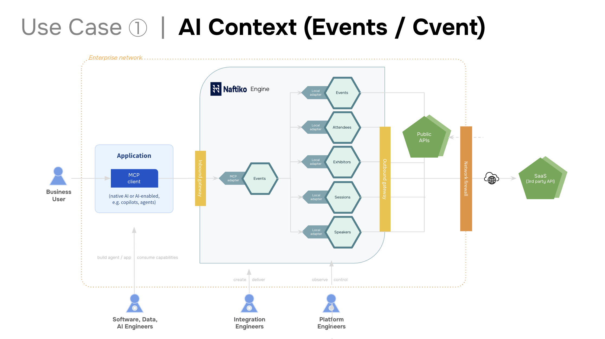

# Manage Events
This is an exploratory proof of concept to understand what and end-to-end event management capability could look like--assembling all the existing standards in a single place to help inform what the capability schema might look like to support our ai context use case, while providing governance along the way.

## Use Case
This is an application for our [Context Engineering use case](https://github.com/naftiko/schema/blob/main/secondary/use-case/examples/use-case-example-context-engineering.yml), leveraging the use case schema being developed to drive use case conversations, as well as how they are applied to each individual capability.

## Capabilities
This end-to-end use cases has six separate capabilities, providing five individual capabilities that can be applied individually, as well as an aggregate capability that brings them all together to provide the right-size context window for an MCP server.

- [Events (Aggregate)](capability-manage-events.yml) - A single aggregate events capability.
    - [Events](capability-manage-events-events.yml) - An individual events capability.
    - [Attendees](capability-manage-events-attendees.yml) - An individual attendees capability.
    - [Exhibitors](capability-manage-events-exhibitors.yml) - An individual exhibitors capability.
    - [Sessions](capability-manage-events-sessions.yml) - An individual sessions capability.
    - [Speakers](capability-manage-events-speakers.yml) - An individual speakers capability.

We are treating this capability as a "monolithic" capability, where all the capabilities are in this repository, rather than putting events, attendees, exhibitors, sessions, and speakers all in each of their own repositories.

## Image
This is an image of this aggregate events AI context capability to try and capture everything going on in the visual language we already use for our deck.

## Folders
This repository is currently broken down into the following folders that help support references made within each capability, providing different layers of the capabilities using existing standards that our customers are using.

- agent-2-agent - Using A2A cards for any of the individual agents.
- api-commons - Using two API commons schema for plans and rate limits.
- arazzo - Using Arazzo for the oauth workflows and eventually events.
- bruno - Every HTTP adapter is setup and tested using Bruno client.
- diagrams - Produced a diagram to help illustrate how capability works.
- model-context-protocol - Generating MCP servers from each OpenAPI.
- openapi - Providing all of the OpenAPI needed for each HTTP adapter.
- postman - Alternatively using Postman instead of Bruno for a client.

## Schemas
All of the JSON Schema are stored centrally via the [schema repository](https://github.com/naftiko/schema) to ensure their reuse across each of the capabilities and use cases being developed as part of this work.

## Rules
All of the Spectral and Vacuum are stored centrally via the [rules repository](https://github.com/naftiko/rules) to ensure their reuse across each of the capabilities and use cases being developed as part of this work.

## Tools
This capability possesses the common artifacts that other open-source tooling already speak, and can power the following tools:

- [**Bruno**](https://naftiko.github.io/technology/docs/tooling/bruno/) - Use Bruno collections and enviroments to work with each individual API used as part of this capbility.
- [**Microcks**](https://naftiko.github.io/technology/docs/tooling/microcks/) - Use Microcks for turning OpenAPI + Examples into sandboxes for all the API used in this collection.
- [**Backstage**](https://naftiko.github.io/technology/docs/tooling/backstage/) - Distribute capabilities and APIs used as part of the capabilities to any Backstage instance.

This capability will eventually run using the Naftiko engine, but also simulatneoulsy work across these open-source tools.

## Changes
I am rapidly iterating upon this set of capabilities as part of ongoing Cvent conversations, helping evolve and strengthen our AI Context use case. To help capture the changes I will try to do bulk updates via commits and PRs, but will wrap with an issue for logging purposes.

- [AI Context Change Log #1](https://github.com/naftiko-capabilities/manage-events/issues/1)

## Contributions
I need your feedback. Please leave via [issues](https://github.com/naftiko-capabilities/manage-events/issues) or in [Slack](https://naftiko.slack.com/archives/C09LLFZDLL9), but also don't hesitate submitting pull requests to fix any problems encountered and leave feedback to help contribute to this work as it happening.
